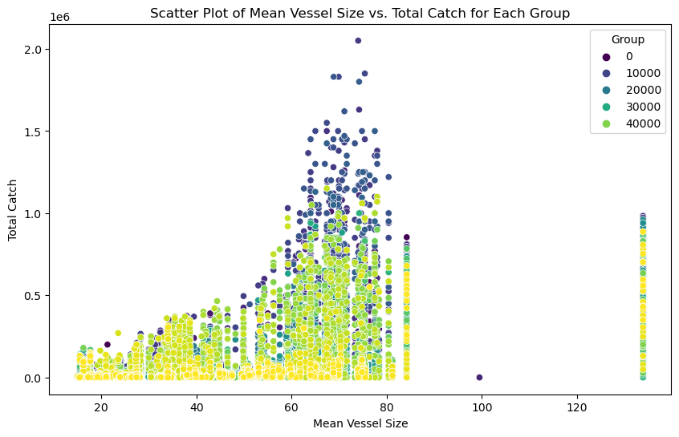

```python
import pandas as pd
import matplotlib.pyplot as plt
import seaborn as sns
```


```python
data = pd.read_csv("elektronisk-rapportering-ers-2018-fangstmelding-dca-simple.csv", sep=";")
data.head()
```


<div>
<style scoped>
    .dataframe tbody tr th:only-of-type {
        vertical-align: middle;
    }

    .dataframe tbody tr th {
        vertical-align: top;
    }

    .dataframe thead th {
        text-align: right;
    }
</style>
<table border="1" class="dataframe">
  <thead>
    <tr style="text-align: right;">
      <th></th>
      <th>Melding ID</th>
      <th>Meldingstidspunkt</th>
      <th>Meldingsdato</th>
      <th>Meldingsklokkeslett</th>
      <th>Starttidspunkt</th>
      <th>Startdato</th>
      <th>Startklokkeslett</th>
      <th>Startposisjon bredde</th>
      <th>Startposisjon lengde</th>
      <th>Hovedområde start (kode)</th>
      <th>...</th>
      <th>Art - FDIR</th>
      <th>Art - gruppe (kode)</th>
      <th>Art - gruppe</th>
      <th>Rundvekt</th>
      <th>Lengdegruppe (kode)</th>
      <th>Lengdegruppe</th>
      <th>Bruttotonnasje 1969</th>
      <th>Bruttotonnasje annen</th>
      <th>Bredde</th>
      <th>Fartøylengde</th>
    </tr>
  </thead>
  <tbody>
    <tr>
      <th>0</th>
      <td>1497177</td>
      <td>01.01.2018</td>
      <td>01.01.2018</td>
      <td>00:00</td>
      <td>31.12.2017</td>
      <td>31.12.2017</td>
      <td>00:00</td>
      <td>-60,35</td>
      <td>-46,133</td>
      <td>NaN</td>
      <td>...</td>
      <td>Antarktisk krill</td>
      <td>506.0</td>
      <td>Antarktisk krill</td>
      <td>706714.0</td>
      <td>5.0</td>
      <td>28 m og over</td>
      <td>9432.0</td>
      <td>NaN</td>
      <td>19,87</td>
      <td>133,88</td>
    </tr>
    <tr>
      <th>1</th>
      <td>1497178</td>
      <td>01.01.2018</td>
      <td>01.01.2018</td>
      <td>00:00</td>
      <td>30.12.2017 23:21</td>
      <td>30.12.2017</td>
      <td>23:21</td>
      <td>74,885</td>
      <td>16,048</td>
      <td>20.0</td>
      <td>...</td>
      <td>Hyse</td>
      <td>202.0</td>
      <td>Hyse</td>
      <td>9594.0</td>
      <td>5.0</td>
      <td>28 m og over</td>
      <td>1476.0</td>
      <td>NaN</td>
      <td>12,6</td>
      <td>56,8</td>
    </tr>
    <tr>
      <th>2</th>
      <td>1497178</td>
      <td>01.01.2018</td>
      <td>01.01.2018</td>
      <td>00:00</td>
      <td>30.12.2017 23:21</td>
      <td>30.12.2017</td>
      <td>23:21</td>
      <td>74,885</td>
      <td>16,048</td>
      <td>20.0</td>
      <td>...</td>
      <td>Torsk</td>
      <td>201.0</td>
      <td>Torsk</td>
      <td>8510.0</td>
      <td>5.0</td>
      <td>28 m og over</td>
      <td>1476.0</td>
      <td>NaN</td>
      <td>12,6</td>
      <td>56,8</td>
    </tr>
    <tr>
      <th>3</th>
      <td>1497178</td>
      <td>01.01.2018</td>
      <td>01.01.2018</td>
      <td>00:00</td>
      <td>30.12.2017 23:21</td>
      <td>30.12.2017</td>
      <td>23:21</td>
      <td>74,885</td>
      <td>16,048</td>
      <td>20.0</td>
      <td>...</td>
      <td>Blåkveite</td>
      <td>301.0</td>
      <td>Blåkveite</td>
      <td>196.0</td>
      <td>5.0</td>
      <td>28 m og over</td>
      <td>1476.0</td>
      <td>NaN</td>
      <td>12,6</td>
      <td>56,8</td>
    </tr>
    <tr>
      <th>4</th>
      <td>1497178</td>
      <td>01.01.2018</td>
      <td>01.01.2018</td>
      <td>00:00</td>
      <td>30.12.2017 23:21</td>
      <td>30.12.2017</td>
      <td>23:21</td>
      <td>74,885</td>
      <td>16,048</td>
      <td>20.0</td>
      <td>...</td>
      <td>Sei</td>
      <td>203.0</td>
      <td>Sei</td>
      <td>134.0</td>
      <td>5.0</td>
      <td>28 m og over</td>
      <td>1476.0</td>
      <td>NaN</td>
      <td>12,6</td>
      <td>56,8</td>
    </tr>
  </tbody>
</table>
<p>5 rows × 45 columns</p>
</div>


```python
data.info()
```

    <class 'pandas.core.frame.DataFrame'>
    RangeIndex: 305434 entries, 0 to 305433
    Data columns (total 45 columns):
     #   Column                    Non-Null Count   Dtype  
    ---  ------                    --------------   -----  
     0   Melding ID                305434 non-null  int64  
     1   Meldingstidspunkt         305434 non-null  object 
     2   Meldingsdato              305434 non-null  object 
     3   Meldingsklokkeslett       305434 non-null  object 
     4   Starttidspunkt            305434 non-null  object 
     5   Startdato                 305434 non-null  object 
     6   Startklokkeslett          305434 non-null  object 
     7   Startposisjon bredde      305434 non-null  object 
     8   Startposisjon lengde      305434 non-null  object 
     9   Hovedområde start (kode)  303433 non-null  float64
     10  Hovedområde start         301310 non-null  object 
     11  Lokasjon start (kode)     303433 non-null  float64
     12  Havdybde start            305434 non-null  int64  
     13  Stopptidspunkt            305434 non-null  object 
     14  Stoppdato                 305434 non-null  object 
     15  Stoppklokkeslett          305434 non-null  object 
     16  Varighet                  305434 non-null  int64  
     17  Fangstår                  305434 non-null  int64  
     18  Stopposisjon bredde       305434 non-null  object 
     19  Stopposisjon lengde       305434 non-null  object 
     20  Hovedområde stopp (kode)  303472 non-null  float64
     21  Hovedområde stopp         301310 non-null  object 
     22  Lokasjon stopp (kode)     303472 non-null  float64
     23  Havdybde stopp            305434 non-null  int64  
     24  Trekkavstand              305410 non-null  float64
     25  Redskap FAO (kode)        305434 non-null  object 
     26  Redskap FAO               305246 non-null  object 
     27  Redskap FDIR (kode)       305246 non-null  float64
     28  Redskap FDIR              305246 non-null  object 
     29  Hovedart FAO (kode)       300456 non-null  object 
     30  Hovedart FAO              300456 non-null  object 
     31  Hovedart - FDIR (kode)    300456 non-null  float64
     32  Art FAO (kode)            300456 non-null  object 
     33  Art FAO                   300452 non-null  object 
     34  Art - FDIR (kode)         300452 non-null  float64
     35  Art - FDIR                300452 non-null  object 
     36  Art - gruppe (kode)       300452 non-null  float64
     37  Art - gruppe              300452 non-null  object 
     38  Rundvekt                  300456 non-null  float64
     39  Lengdegruppe (kode)       304750 non-null  float64
     40  Lengdegruppe              304750 non-null  object 
     41  Bruttotonnasje 1969       234005 non-null  float64
     42  Bruttotonnasje annen      74774 non-null   float64
     43  Bredde                    304750 non-null  object 
     44  Fartøylengde              305434 non-null  object 
    dtypes: float64(13), int64(5), object(27)
    memory usage: 104.9+ MB
    


```python
data["Hovedområde start (kode)"]
```


    0          NaN
    1         20.0
    2         20.0
    3         20.0
    4         20.0
              ... 
    305429    21.0
    305430    21.0
    305431    21.0
    305432    21.0
    305433    21.0
    Name: Hovedområde start (kode), Length: 305434, dtype: float64


```python
data.describe()
```


<div>
<style scoped>
    .dataframe tbody tr th:only-of-type {
        vertical-align: middle;
    }

    .dataframe tbody tr th {
        vertical-align: top;
    }

    .dataframe thead th {
        text-align: right;
    }
</style>
<table border="1" class="dataframe">
  <thead>
    <tr style="text-align: right;">
      <th></th>
      <th>Melding ID</th>
      <th>Hovedområde start (kode)</th>
      <th>Lokasjon start (kode)</th>
      <th>Havdybde start</th>
      <th>Varighet</th>
      <th>Fangstår</th>
      <th>Hovedområde stopp (kode)</th>
      <th>Lokasjon stopp (kode)</th>
      <th>Havdybde stopp</th>
      <th>Trekkavstand</th>
      <th>Redskap FDIR (kode)</th>
      <th>Hovedart - FDIR (kode)</th>
      <th>Art - FDIR (kode)</th>
      <th>Art - gruppe (kode)</th>
      <th>Rundvekt</th>
      <th>Lengdegruppe (kode)</th>
      <th>Bruttotonnasje 1969</th>
      <th>Bruttotonnasje annen</th>
    </tr>
  </thead>
  <tbody>
    <tr>
      <th>count</th>
      <td>3.054340e+05</td>
      <td>303433.000000</td>
      <td>303433.000000</td>
      <td>305434.000000</td>
      <td>305434.000000</td>
      <td>305434.000000</td>
      <td>303472.000000</td>
      <td>303472.000000</td>
      <td>305434.000000</td>
      <td>3.054100e+05</td>
      <td>305246.000000</td>
      <td>300456.000000</td>
      <td>300452.000000</td>
      <td>300452.000000</td>
      <td>3.004560e+05</td>
      <td>304750.000000</td>
      <td>234005.000000</td>
      <td>74774.000000</td>
    </tr>
    <tr>
      <th>mean</th>
      <td>1.658783e+06</td>
      <td>14.463737</td>
      <td>19.074712</td>
      <td>-228.025292</td>
      <td>537.095526</td>
      <td>2017.999941</td>
      <td>14.430415</td>
      <td>18.883353</td>
      <td>-229.084850</td>
      <td>1.566397e+04</td>
      <td>46.489746</td>
      <td>1326.729934</td>
      <td>1414.625914</td>
      <td>259.746585</td>
      <td>7.438208e+03</td>
      <td>4.575032</td>
      <td>1408.386975</td>
      <td>186.172573</td>
    </tr>
    <tr>
      <th>std</th>
      <td>9.130738e+04</td>
      <td>13.001244</td>
      <td>18.469340</td>
      <td>226.062493</td>
      <td>2201.624688</td>
      <td>0.007677</td>
      <td>12.973150</td>
      <td>18.361244</td>
      <td>224.277365</td>
      <td>9.033085e+04</td>
      <td>13.534202</td>
      <td>614.506560</td>
      <td>633.188386</td>
      <td>320.124913</td>
      <td>4.281086e+04</td>
      <td>0.692769</td>
      <td>1148.384145</td>
      <td>165.761157</td>
    </tr>
    <tr>
      <th>min</th>
      <td>1.497177e+06</td>
      <td>0.000000</td>
      <td>0.000000</td>
      <td>-5388.000000</td>
      <td>0.000000</td>
      <td>2017.000000</td>
      <td>0.000000</td>
      <td>0.000000</td>
      <td>-5388.000000</td>
      <td>0.000000e+00</td>
      <td>11.000000</td>
      <td>412.000000</td>
      <td>211.000000</td>
      <td>101.000000</td>
      <td>0.000000e+00</td>
      <td>3.000000</td>
      <td>104.000000</td>
      <td>21.000000</td>
    </tr>
    <tr>
      <th>25%</th>
      <td>1.567228e+06</td>
      <td>5.000000</td>
      <td>7.000000</td>
      <td>-273.000000</td>
      <td>123.000000</td>
      <td>2018.000000</td>
      <td>5.000000</td>
      <td>7.000000</td>
      <td>-274.000000</td>
      <td>2.533000e+03</td>
      <td>32.000000</td>
      <td>1022.000000</td>
      <td>1022.000000</td>
      <td>201.000000</td>
      <td>6.400000e+01</td>
      <td>4.000000</td>
      <td>496.000000</td>
      <td>87.000000</td>
    </tr>
    <tr>
      <th>50%</th>
      <td>1.674230e+06</td>
      <td>8.000000</td>
      <td>12.000000</td>
      <td>-196.000000</td>
      <td>296.000000</td>
      <td>2018.000000</td>
      <td>8.000000</td>
      <td>12.000000</td>
      <td>-198.000000</td>
      <td>7.598000e+03</td>
      <td>51.000000</td>
      <td>1032.000000</td>
      <td>1032.000000</td>
      <td>203.000000</td>
      <td>3.000000e+02</td>
      <td>5.000000</td>
      <td>1184.000000</td>
      <td>149.000000</td>
    </tr>
    <tr>
      <th>75%</th>
      <td>1.735590e+06</td>
      <td>20.000000</td>
      <td>24.000000</td>
      <td>-128.000000</td>
      <td>494.000000</td>
      <td>2018.000000</td>
      <td>20.000000</td>
      <td>24.000000</td>
      <td>-127.000000</td>
      <td>2.259900e+04</td>
      <td>55.000000</td>
      <td>1038.000000</td>
      <td>2202.000000</td>
      <td>302.000000</td>
      <td>2.236000e+03</td>
      <td>5.000000</td>
      <td>2053.000000</td>
      <td>236.000000</td>
    </tr>
    <tr>
      <th>max</th>
      <td>1.800291e+06</td>
      <td>81.000000</td>
      <td>87.000000</td>
      <td>1220.000000</td>
      <td>125534.000000</td>
      <td>2018.000000</td>
      <td>81.000000</td>
      <td>87.000000</td>
      <td>1616.000000</td>
      <td>1.588863e+07</td>
      <td>80.000000</td>
      <td>6619.000000</td>
      <td>6619.000000</td>
      <td>9903.000000</td>
      <td>1.100000e+06</td>
      <td>5.000000</td>
      <td>9432.000000</td>
      <td>1147.000000</td>
    </tr>
  </tbody>
</table>
</div>


```python
data.isnull()
```


<div>
<style scoped>
    .dataframe tbody tr th:only-of-type {
        vertical-align: middle;
    }

    .dataframe tbody tr th {
        vertical-align: top;
    }

    .dataframe thead th {
        text-align: right;
    }
</style>
<table border="1" class="dataframe">
  <thead>
    <tr style="text-align: right;">
      <th></th>
      <th>Melding ID</th>
      <th>Meldingstidspunkt</th>
      <th>Meldingsdato</th>
      <th>Meldingsklokkeslett</th>
      <th>Starttidspunkt</th>
      <th>Startdato</th>
      <th>Startklokkeslett</th>
      <th>Startposisjon bredde</th>
      <th>Startposisjon lengde</th>
      <th>Hovedområde start (kode)</th>
      <th>...</th>
      <th>Art - FDIR</th>
      <th>Art - gruppe (kode)</th>
      <th>Art - gruppe</th>
      <th>Rundvekt</th>
      <th>Lengdegruppe (kode)</th>
      <th>Lengdegruppe</th>
      <th>Bruttotonnasje 1969</th>
      <th>Bruttotonnasje annen</th>
      <th>Bredde</th>
      <th>Fartøylengde</th>
    </tr>
  </thead>
  <tbody>
    <tr>
      <th>0</th>
      <td>False</td>
      <td>False</td>
      <td>False</td>
      <td>False</td>
      <td>False</td>
      <td>False</td>
      <td>False</td>
      <td>False</td>
      <td>False</td>
      <td>True</td>
      <td>...</td>
      <td>False</td>
      <td>False</td>
      <td>False</td>
      <td>False</td>
      <td>False</td>
      <td>False</td>
      <td>False</td>
      <td>True</td>
      <td>False</td>
      <td>False</td>
    </tr>
    <tr>
      <th>1</th>
      <td>False</td>
      <td>False</td>
      <td>False</td>
      <td>False</td>
      <td>False</td>
      <td>False</td>
      <td>False</td>
      <td>False</td>
      <td>False</td>
      <td>False</td>
      <td>...</td>
      <td>False</td>
      <td>False</td>
      <td>False</td>
      <td>False</td>
      <td>False</td>
      <td>False</td>
      <td>False</td>
      <td>True</td>
      <td>False</td>
      <td>False</td>
    </tr>
    <tr>
      <th>2</th>
      <td>False</td>
      <td>False</td>
      <td>False</td>
      <td>False</td>
      <td>False</td>
      <td>False</td>
      <td>False</td>
      <td>False</td>
      <td>False</td>
      <td>False</td>
      <td>...</td>
      <td>False</td>
      <td>False</td>
      <td>False</td>
      <td>False</td>
      <td>False</td>
      <td>False</td>
      <td>False</td>
      <td>True</td>
      <td>False</td>
      <td>False</td>
    </tr>
    <tr>
      <th>3</th>
      <td>False</td>
      <td>False</td>
      <td>False</td>
      <td>False</td>
      <td>False</td>
      <td>False</td>
      <td>False</td>
      <td>False</td>
      <td>False</td>
      <td>False</td>
      <td>...</td>
      <td>False</td>
      <td>False</td>
      <td>False</td>
      <td>False</td>
      <td>False</td>
      <td>False</td>
      <td>False</td>
      <td>True</td>
      <td>False</td>
      <td>False</td>
    </tr>
    <tr>
      <th>4</th>
      <td>False</td>
      <td>False</td>
      <td>False</td>
      <td>False</td>
      <td>False</td>
      <td>False</td>
      <td>False</td>
      <td>False</td>
      <td>False</td>
      <td>False</td>
      <td>...</td>
      <td>False</td>
      <td>False</td>
      <td>False</td>
      <td>False</td>
      <td>False</td>
      <td>False</td>
      <td>False</td>
      <td>True</td>
      <td>False</td>
      <td>False</td>
    </tr>
    <tr>
      <th>...</th>
      <td>...</td>
      <td>...</td>
      <td>...</td>
      <td>...</td>
      <td>...</td>
      <td>...</td>
      <td>...</td>
      <td>...</td>
      <td>...</td>
      <td>...</td>
      <td>...</td>
      <td>...</td>
      <td>...</td>
      <td>...</td>
      <td>...</td>
      <td>...</td>
      <td>...</td>
      <td>...</td>
      <td>...</td>
      <td>...</td>
      <td>...</td>
    </tr>
    <tr>
      <th>305429</th>
      <td>False</td>
      <td>False</td>
      <td>False</td>
      <td>False</td>
      <td>False</td>
      <td>False</td>
      <td>False</td>
      <td>False</td>
      <td>False</td>
      <td>False</td>
      <td>...</td>
      <td>False</td>
      <td>False</td>
      <td>False</td>
      <td>False</td>
      <td>False</td>
      <td>False</td>
      <td>False</td>
      <td>True</td>
      <td>False</td>
      <td>False</td>
    </tr>
    <tr>
      <th>305430</th>
      <td>False</td>
      <td>False</td>
      <td>False</td>
      <td>False</td>
      <td>False</td>
      <td>False</td>
      <td>False</td>
      <td>False</td>
      <td>False</td>
      <td>False</td>
      <td>...</td>
      <td>False</td>
      <td>False</td>
      <td>False</td>
      <td>False</td>
      <td>False</td>
      <td>False</td>
      <td>False</td>
      <td>True</td>
      <td>False</td>
      <td>False</td>
    </tr>
    <tr>
      <th>305431</th>
      <td>False</td>
      <td>False</td>
      <td>False</td>
      <td>False</td>
      <td>False</td>
      <td>False</td>
      <td>False</td>
      <td>False</td>
      <td>False</td>
      <td>False</td>
      <td>...</td>
      <td>False</td>
      <td>False</td>
      <td>False</td>
      <td>False</td>
      <td>False</td>
      <td>False</td>
      <td>False</td>
      <td>True</td>
      <td>False</td>
      <td>False</td>
    </tr>
    <tr>
      <th>305432</th>
      <td>False</td>
      <td>False</td>
      <td>False</td>
      <td>False</td>
      <td>False</td>
      <td>False</td>
      <td>False</td>
      <td>False</td>
      <td>False</td>
      <td>False</td>
      <td>...</td>
      <td>False</td>
      <td>False</td>
      <td>False</td>
      <td>False</td>
      <td>False</td>
      <td>False</td>
      <td>False</td>
      <td>True</td>
      <td>False</td>
      <td>False</td>
    </tr>
    <tr>
      <th>305433</th>
      <td>False</td>
      <td>False</td>
      <td>False</td>
      <td>False</td>
      <td>False</td>
      <td>False</td>
      <td>False</td>
      <td>False</td>
      <td>False</td>
      <td>False</td>
      <td>...</td>
      <td>False</td>
      <td>False</td>
      <td>False</td>
      <td>False</td>
      <td>False</td>
      <td>False</td>
      <td>False</td>
      <td>True</td>
      <td>False</td>
      <td>False</td>
    </tr>
  </tbody>
</table>
<p>305434 rows × 45 columns</p>
</div>


```python
data.iloc[100]
```


    Melding ID                           1497342
    Meldingstidspunkt           01.01.2018 23:30
    Meldingsdato                      01.01.2018
    Meldingsklokkeslett                    23:30
    Starttidspunkt              01.01.2018 07:58
    Startdato                         01.01.2018
    Startklokkeslett                       07:58
    Startposisjon bredde                  71,262
    Startposisjon lengde                  25,188
    Hovedområde start (kode)                 4.0
    Hovedområde start              Vest-Finnmark
    Lokasjon start (kode)                   26.0
    Havdybde start                          -289
    Stopptidspunkt              01.01.2018 14:04
    Stoppdato                         01.01.2018
    Stoppklokkeslett                       14:04
    Varighet                                 366
    Fangstår                                2018
    Stopposisjon bredde                   71,317
    Stopposisjon lengde                   25,225
    Hovedområde stopp (kode)                 4.0
    Hovedområde stopp              Vest-Finnmark
    Lokasjon stopp (kode)                   26.0
    Havdybde stopp                          -294
    Trekkavstand                          6278.0
    Redskap FAO (kode)                       OTB
    Redskap FAO                  Bunntrål, otter
    Redskap FDIR (kode)                     51.0
    Redskap FDIR                        Bunntrål
    Hovedart FAO (kode)                      COD
    Hovedart FAO                           Torsk
    Hovedart - FDIR (kode)                1022.0
    Art FAO (kode)                           HAD
    Art FAO                                 Hyse
    Art - FDIR (kode)                     1027.0
    Art - FDIR                              Hyse
    Art - gruppe (kode)                    202.0
    Art - gruppe                            Hyse
    Rundvekt                               580.0
    Lengdegruppe (kode)                      5.0
    Lengdegruppe                    28 m og over
    Bruttotonnasje 1969                    691.0
    Bruttotonnasje annen                     NaN
    Bredde                                  10,5
    Fartøylengde                           39,79
    Name: 100, dtype: object


```python
data.iloc[21]
```


    Melding ID                                                   1497229
    Meldingstidspunkt                                   01.01.2018 15:49
    Meldingsdato                                              01.01.2018
    Meldingsklokkeslett                                            15:49
    Starttidspunkt                                      01.01.2018 13:07
    Startdato                                                 01.01.2018
    Startklokkeslett                                               13:07
    Startposisjon bredde                                          67,826
    Startposisjon lengde                                          12,967
    Hovedområde start (kode)                                         5.0
    Hovedområde start                      Røstbanken til Malangsgrunnen
    Lokasjon start (kode)                                            9.0
    Havdybde start                                                   -71
    Stopptidspunkt                                      01.01.2018 14:19
    Stoppdato                                                 01.01.2018
    Stoppklokkeslett                                               14:19
    Varighet                                                          72
    Fangstår                                                        2018
    Stopposisjon bredde                                           67,829
    Stopposisjon lengde                                           12,933
    Hovedområde stopp (kode)                                         5.0
    Hovedområde stopp                      Røstbanken til Malangsgrunnen
    Lokasjon stopp (kode)                                            9.0
    Havdybde stopp                                                   -54
    Trekkavstand                                                  1471.0
    Redskap FAO (kode)                                                SV
    Redskap FAO                                                Snurrevad
    Redskap FDIR (kode)                                             61.0
    Redskap FDIR                                               Snurrevad
    Hovedart FAO (kode)                                              COD
    Hovedart FAO                                                   Torsk
    Hovedart - FDIR (kode)                                        1022.0
    Art FAO (kode)                                                   PLE
    Art FAO                                                    Rødspette
    Art - FDIR (kode)                                             2312.0
    Art - FDIR                                                 Rødspette
    Art - gruppe (kode)                                            320.0
    Art - gruppe                Annen flatfisk, bunnfisk og dypvannsfisk
    Rundvekt                                                        50.0
    Lengdegruppe (kode)                                              3.0
    Lengdegruppe                                              15-20,99 m
    Bruttotonnasje 1969                                              NaN
    Bruttotonnasje annen                                            51.0
    Bredde                                                          5,06
    Fartøylengde                                                    19,1
    Name: 21, dtype: object


```python
coloumns_to_convert = ["Startposisjon bredde", "Startposisjon lengde", "Stopposisjon bredde", "Stopposisjon lengde", "Bredde", "Fartøylengde"]
data[coloumns_to_convert] = data[coloumns_to_convert].replace({',': '.'}, regex=True)
```


```python
data[coloumns_to_convert] = data[coloumns_to_convert].astype(float)
```


```python
data.info()
```

    <class 'pandas.core.frame.DataFrame'>
    RangeIndex: 305434 entries, 0 to 305433
    Data columns (total 45 columns):
     #   Column                    Non-Null Count   Dtype  
    ---  ------                    --------------   -----  
     0   Melding ID                305434 non-null  int64  
     1   Meldingstidspunkt         305434 non-null  object 
     2   Meldingsdato              305434 non-null  object 
     3   Meldingsklokkeslett       305434 non-null  object 
     4   Starttidspunkt            305434 non-null  object 
     5   Startdato                 305434 non-null  object 
     6   Startklokkeslett          305434 non-null  object 
     7   Startposisjon bredde      305434 non-null  float64
     8   Startposisjon lengde      305434 non-null  float64
     9   Hovedområde start (kode)  303433 non-null  float64
     10  Hovedområde start         301310 non-null  object 
     11  Lokasjon start (kode)     303433 non-null  float64
     12  Havdybde start            305434 non-null  int64  
     13  Stopptidspunkt            305434 non-null  object 
     14  Stoppdato                 305434 non-null  object 
     15  Stoppklokkeslett          305434 non-null  object 
     16  Varighet                  305434 non-null  int64  
     17  Fangstår                  305434 non-null  int64  
     18  Stopposisjon bredde       305434 non-null  float64
     19  Stopposisjon lengde       305434 non-null  float64
     20  Hovedområde stopp (kode)  303472 non-null  float64
     21  Hovedområde stopp         301310 non-null  object 
     22  Lokasjon stopp (kode)     303472 non-null  float64
     23  Havdybde stopp            305434 non-null  int64  
     24  Trekkavstand              305410 non-null  float64
     25  Redskap FAO (kode)        305434 non-null  object 
     26  Redskap FAO               305246 non-null  object 
     27  Redskap FDIR (kode)       305246 non-null  float64
     28  Redskap FDIR              305246 non-null  object 
     29  Hovedart FAO (kode)       300456 non-null  object 
     30  Hovedart FAO              300456 non-null  object 
     31  Hovedart - FDIR (kode)    300456 non-null  float64
     32  Art FAO (kode)            300456 non-null  object 
     33  Art FAO                   300452 non-null  object 
     34  Art - FDIR (kode)         300452 non-null  float64
     35  Art - FDIR                300452 non-null  object 
     36  Art - gruppe (kode)       300452 non-null  float64
     37  Art - gruppe              300452 non-null  object 
     38  Rundvekt                  300456 non-null  float64
     39  Lengdegruppe (kode)       304750 non-null  float64
     40  Lengdegruppe              304750 non-null  object 
     41  Bruttotonnasje 1969       234005 non-null  float64
     42  Bruttotonnasje annen      74774 non-null   float64
     43  Bredde                    304750 non-null  float64
     44  Fartøylengde              305434 non-null  float64
    dtypes: float64(19), int64(5), object(21)
    memory usage: 104.9+ MB
    


```python

```


```python
grouped_data = data.groupby("Melding ID")
```


```python
type(grouped_data)
```


    pandas.core.groupby.generic.DataFrameGroupBy


#Now we have som grouped items


```python
total_catch_by_group = grouped_data["Rundvekt"].sum()
vessel_size_by_group = grouped_data["Fartøylengde"].mean()
```


```python
vessel_size_by_group
```


    Melding ID
    1497177    133.88
    1497178     56.80
    1497229     19.10
    1497249     49.95
    1497288     27.49
                ...  
    1800268     56.20
    1800269     44.85
    1800285     68.80
    1800286     39.79
    1800291     57.30
    Name: Fartøylengde, Length: 49437, dtype: float64


```python
total_catch_by_group
```


    Melding ID
    1497177    706714.0
    1497178     66154.0
    1497229      1854.0
    1497249       871.0
    1497288      5304.0
                 ...   
    1800268     36879.0
    1800269     25363.0
    1800285     29247.0
    1800286     20262.0
    1800291     45742.0
    Name: Rundvekt, Length: 49437, dtype: float64


```python
scatter_data = pd.DataFrame({'TotalCatch': total_catch_by_group, 'MeanVesselSize': vessel_size_by_group}).reset_index()
scatter_data['Group'] = scatter_data.index

# Create a scatter plot
plt.figure(figsize=(10, 6))
sns.scatterplot(x='MeanVesselSize', y='TotalCatch', hue='Group', data=scatter_data, palette='viridis')
plt.title('Scatter Plot of Mean Vessel Size vs. Total Catch for Each Group')
plt.xlabel('Mean Vessel Size')
plt.ylabel('Total Catch')
plt.legend(title='Group')
plt.show()
```


    

    


```python

```
